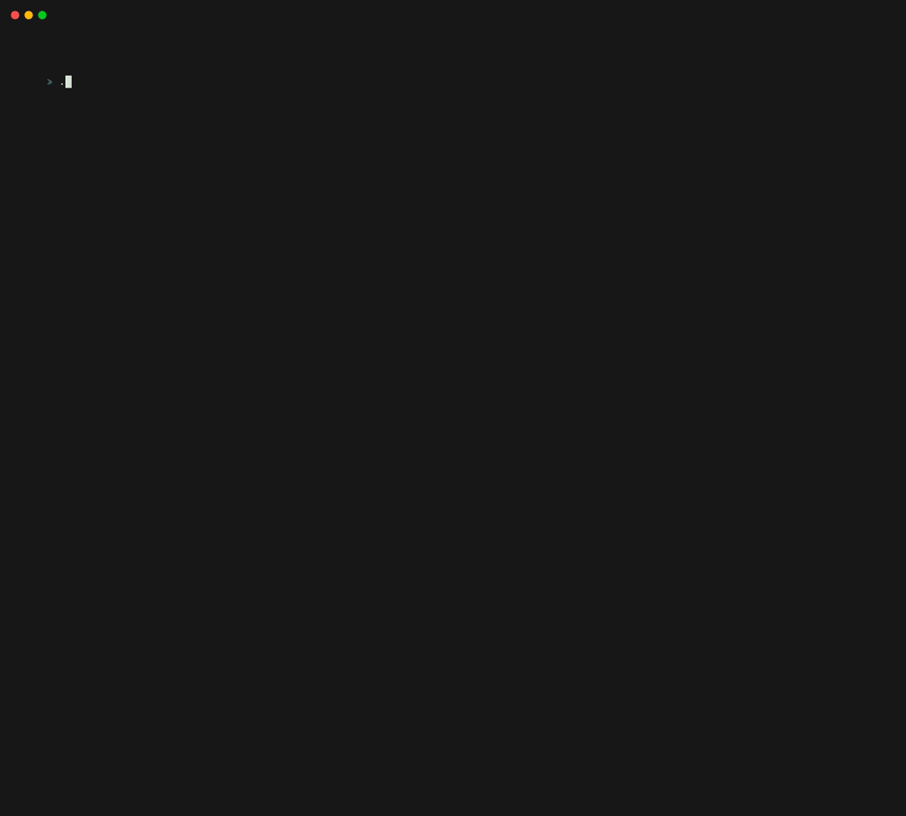

<h1 align="center">💻 Hackertea | Hackernews TUI</h1>

A minimal application for browsing Hacker News on the terminal

 

-----
A command-line interface (CLI) tool that allows users to browse the Top, New, and Best stories on Hacker News. The tool includes a minimalist text-based user interface (TUI) that is developed using Bubble Tea, Lip Gloss, and Bubble libraries.

## Features

- Read Top, New and Best stories.
- Fetch stories concurrently. (You can set the number of workers in the config file)
- In-memory thread-safe cache for caching news.
- A shiny UI to gaze your eyes upon.
    - Tabs
    - Separate pagination for each tab
    - Fetch next pages
    - Vim-like movements

## Libraries used

* [Bubbletea](https://github.com/charmbracelet/bubbles): The fun, functional and stateful way to build terminal apps.
* [Bubbles](https://github.com/charmbracelet/bubbles): Common Bubble Tea components such as text inputs, viewports, spinners and so on
* [Lip Gloss](https://github.com/charmbracelet/lipgloss): Style, format and layout tools for terminal applications

## Styling

The default theme is already loaded by default, but the good news is that you have the option to add any theme of your choice!
Simply take a look at the "config-example.yaml" file to see the available options.

## Roadmap

- [ ] Add more screens
    - [ ] Add Comments screen
    - [ ] Add User profile screen
    - [ ] Add Ask HN screen
    - [ ] Add Jobs screen
- [ ] Add Changelog
- [ ] Add additional styling options w/ Examples
- [ ] Multi-language Support

## Contributing

Contributions are what make the open source community such an amazing place to learn, inspire, and create. Any contributions you make are **greatly appreciated**.

You can open issues for bugs you've found or features you think are missing. You can also submit pull requests to this repository. To get started, take a look at [CONTRIBUTING.md](CONTRIBUTING.md)

